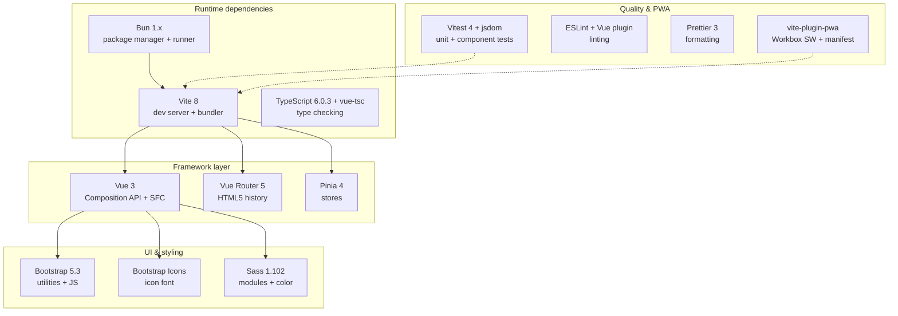

# Project Overview

## Purpose

SnapUp demonstrates the main frontend interactions of an ecommerce storefront:

- browsing a product catalog;
- browsing by category;
- searching for products;
- viewing a product detail page;
- choosing a quantity;
- adding, updating, and removing cart entries; and
- retaining the cart after a browser reload.

It is best treated as a learning or portfolio application. It does **not** currently contain a
backend, user accounts, payment processing, inventory reservations, checkout fulfillment, or an
order database.

The catalog is supplied by the
[DummyJSON products API](https://dummyjson.com/docs/products), which is intended for prototypes and
testing.

## Technology choices

| Technology | Responsibility | Project location |
|---|---|---|
| Vue 3 | Components and reactive UI | `src/**/*.vue` |
| TypeScript | Static types and editor checking | `src/**/*.ts`, `tsconfig*.json` |
| Vue Router | Maps URLs to page components | `src/router/index.ts` |
| Pinia | Shared product, category, search, cart, and sidebar state | `src/stores/` |
| Bootstrap | Grid, spacing, typography, icons, and carousel behavior | imported by `src/main.ts` |
| Sass | Global theme and component-specific styling | `src/**/*.scss` |
| Vite | Development server and production build | `vite.config.ts` |
| Bun | Dependency installation and scripts | `package.json`, `bun.lock` |
| Vitest | Unit/component test runner | `vitest.config.ts` |
| Vite PWA | Manifest and generated service worker | `vite.config.ts`, `src/main.ts` |
| Vercel | Static production hosting and SPA rewrite | `vercel.json` |

Vue recommends Single-File Components for non-trivial frontends with a build step. See
[Vue Single-File Components](https://vuejs.org/guide/scaling-up/sfc) and
[`<script setup>`](https://vuejs.org/api/sfc-script-setup.html).

## Architecture snapshot

## Primary user journeys

### Browse the homepage

1. The application requests categories and the first 50 products.
2. Products are shuffled in the browser.
3. The page shows the complete shuffled list.
4. It also groups matching products under the first four returned categories.

### Browse a category

1. A category link opens `/category/:category`.
2. The category view watches the route parameter.
3. The category store requests matching products.
4. `ProductList` renders the returned collection.

### Search

1. The navbar creates `/search/:searchTerm`.
2. The search view reads the route parameter.
3. The search store calls the DummyJSON search endpoint.
4. Results are rendered with the same product-grid components.

### Add a product to the cart

1. `/product/:id` loads one product.
2. The view calculates its discounted unit price.
3. The chosen quantity is sent to the cart store.
4. The cart store updates Pinia state and serializes the cart to `localStorage`.
5. The navbar reacts to the state change and updates its cart indicator.

The persistence behavior is based on the browser
[Web Storage API](https://developer.mozilla.org/en-US/docs/Web/API/Web_Storage_API). `localStorage`
is scoped to the site origin and normally persists across browser sessions.

## Build outputs

- `dist/` — Vite production bundle (static assets, hashed filenames, `index.html`).
- `dev-dist/` — PWA development build (service worker active in dev).
- `vercel.json` rewrites all paths to `index.html` for SPA deep-linking.

---

## Next steps

- [Architecture & data flow](02-architecture-and-data-flow.md) — how the pieces connect
- [Folder structure](03-folder-structure.md) — where files live
- [Components, pages & routes](04-components-pages-and-routes.md) — UI inventory
- [Known issues & roadmap](07-known-issues-and-roadmap.md) — what needs fixing
