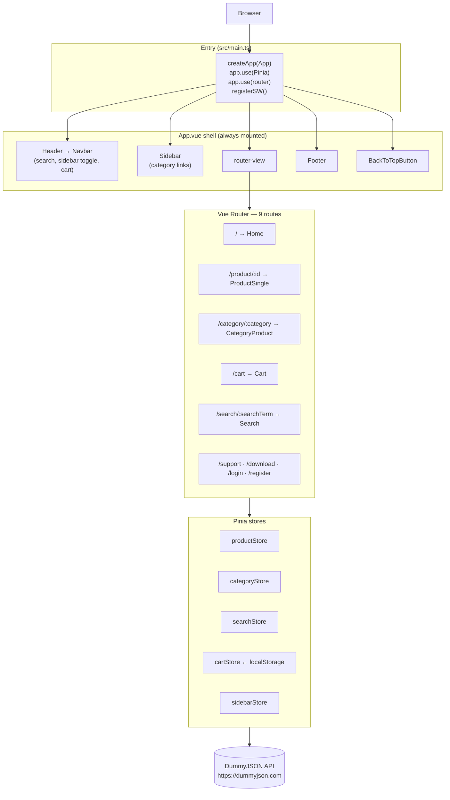
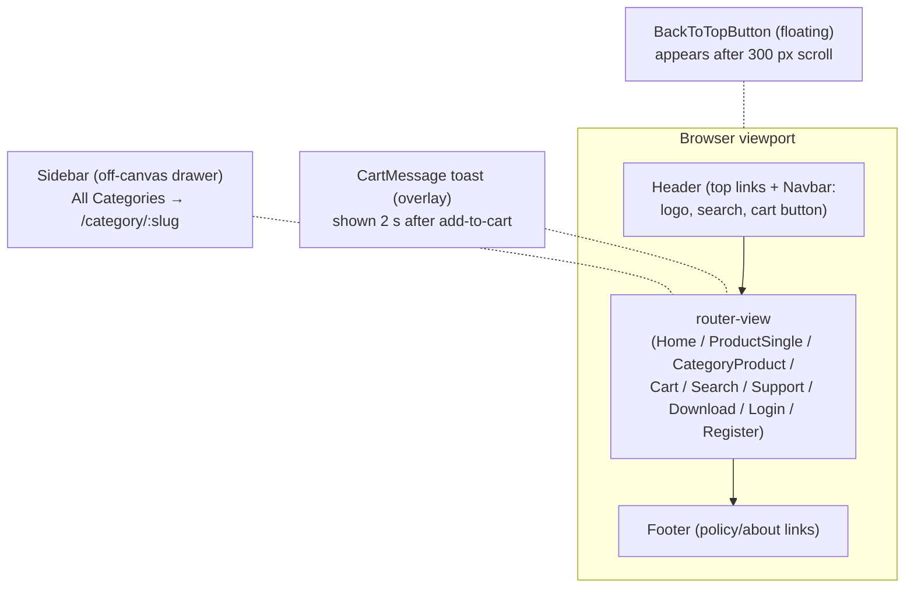
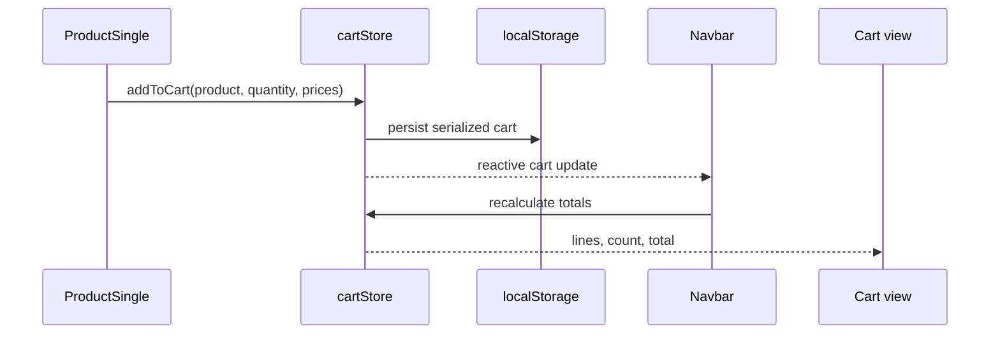

# Architecture and Data Flow

## High-level architecture



This is a client-side SPA. Vue Router changes the component shown inside `router-view` without
requesting a new HTML document for every navigation. Vue Router is Vue's official client-side
routing solution; see the [Vue Router guide](https://router.vuejs.org/guide/).

## Page layout (App shell)

Every route renders inside the same persistent shell owned by [`src/App.vue`](../src/App.vue).
Only `router-view` (and the conditional `CartMessage` toast) changes per page:



```text
┌─────────────────────────────────────┐
│ Header → Navbar                     │
├──────┬──────────────────────────────┤
│ Side │ router-view                  │
│ bar  │                              │
│ (hid │                              │
│ den) │                              │
├──────┴──────────────────────────────┤
│ Footer                              │
└─────────────────────────────────────┘
  + CartMessage overlay (conditional)
  + BackToTopButton (floating, >300px)
```

## Startup sequence

[`src/main.ts`](../src/main.ts) is the entry point:

1. Bootstrap CSS, Bootstrap Icons, Bootstrap JavaScript, and global Sass are loaded.
2. `createApp(App)` creates the Vue application.
3. Pinia and the router are installed.
4. The PWA registration helper is invoked when service workers are supported.
5. Vue mounts to the `#app` element in `index.html`.

[`src/App.vue`](../src/App.vue) owns the persistent shell:

```text
Header
Sidebar
router-view
Footer
```

## Routing

[`src/router/index.ts`](../src/router/index.ts) uses `createWebHistory`. Home is imported eagerly;
the other pages use dynamic imports and therefore become separate build chunks. This follows Vue
Router's [lazy-loading route pattern](https://router.vuejs.org/guide/advanced/lazy-loading).

## Pinia stores

Pinia separates shared state from rendering. Its concepts are documented in the
[official Pinia documentation](https://pinia.vuejs.org/core-concepts/).

| Store | State owned | External dependency |
|---|---|---|
| `productStore` | Product list, selected product, request statuses | DummyJSON |
| `categoryStore` | Categories, selected category products, statuses | DummyJSON |
| `searchStore` | Search results and request status | DummyJSON |
| `cartStore` | Cart lines, totals, item count, confirmation visibility | `localStorage` |
| `sidebarStore` | Sidebar open/closed state | None |

The API stores use four status strings from `src/utils/status.ts`:

```text
IDLE → LOADING → SUCCEEDED
                 or FAILED
```

Views use `LOADING` to show `Loader`. Stores expose error state, but the current pages generally do
not render a dedicated error message.

## Catalog data flow

```mermaid
sequenceDiagram
    participant View
    participant Store as Pinia store
    participant API as DummyJSON
    participant List as ProductList
    participant Card as Product

    View->>Store: call fetch action
    Store->>Store: status = LOADING
    Store->>API: fetch products/categories/search
    API-->>Store: JSON response
    Store->>Store: save data; status = SUCCEEDED
    Store-->>View: reactive update
    View->>List: products prop
    List->>List: calculate discountedPrice
    List->>Card: normalized product prop
```

The API endpoints are documented in
[DummyJSON Products](https://dummyjson.com/docs/products). Note that `fetch()` only rejects on
network-level failures; HTTP errors such as 404 still resolve. Production-quality fetch actions
should check `response.ok`, as explained in
[Using the Fetch API](https://developer.mozilla.org/en-US/docs/Web/API/Fetch_API/Using_Fetch).

## Cart data flow



Only the cart is persistent. Product, category, search, and sidebar state are recreated after a
reload.

## Type and utility layers

- `src/types/IProducts.ts` describes product fields.
- `src/types/ICarts.ts` adds cart quantity and line total fields.
- `src/types/IFilters.ts` describes category data, although its current inheritance should be
  corrected; see the [roadmap](07-known-issues-and-roadmap.md).
- `src/utils/apiURL.ts` contains the DummyJSON base URL.
- `src/utils/helpers.ts` formats prices in US dollars.
- `src/utils/images.ts` centralizes imported image assets.
- `src/utils/status.ts` centralizes request status values.

---

## Next steps

- [Folder structure](03-folder-structure.md) — where files live
- [Components, pages & routes](04-components-pages-and-routes.md) — UI inventory
- [Pinia stores deep-dive](06-development-testing-and-deployment.md#pinia-stores) — store internals
- [Known issues & roadmap](07-known-issues-and-roadmap.md) — architecture-level fixes
