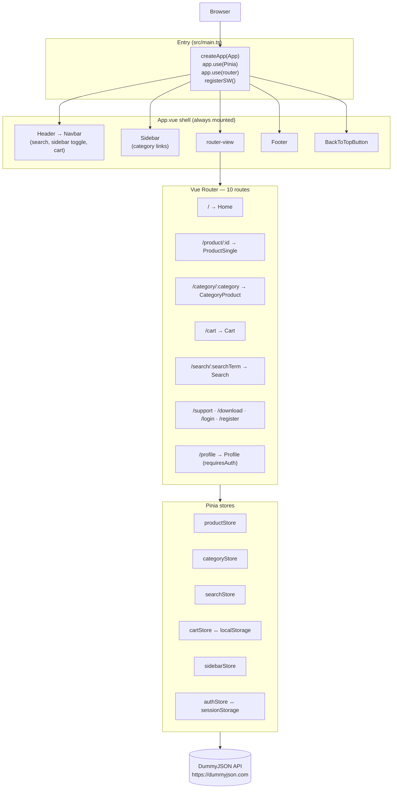
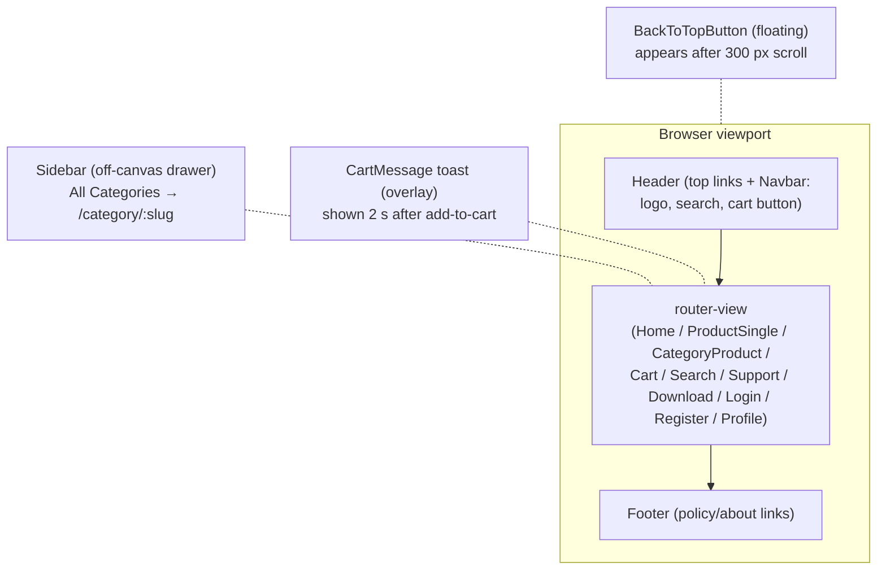
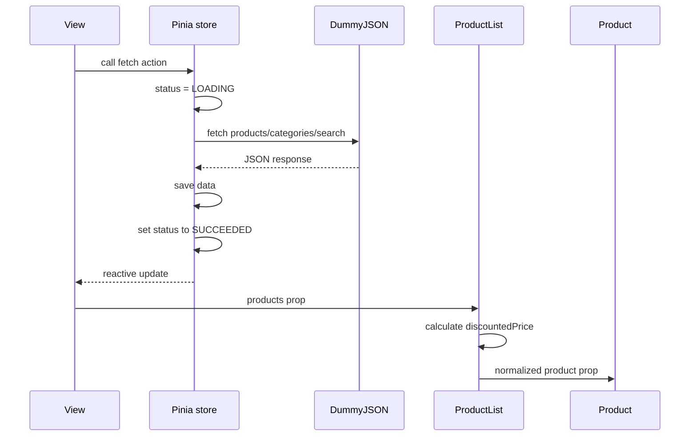
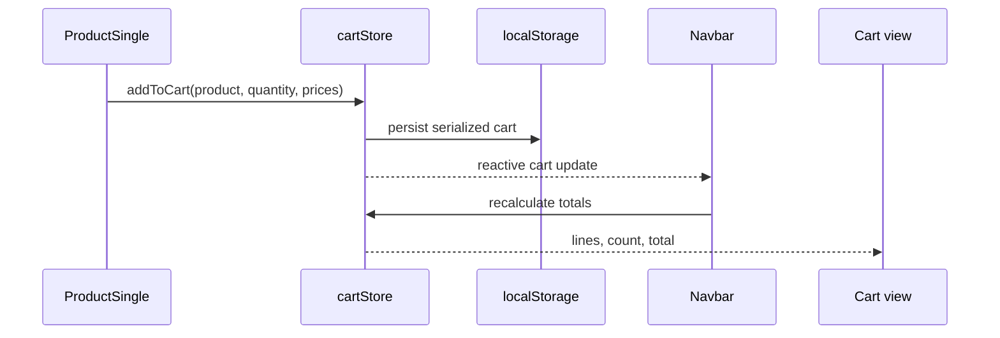
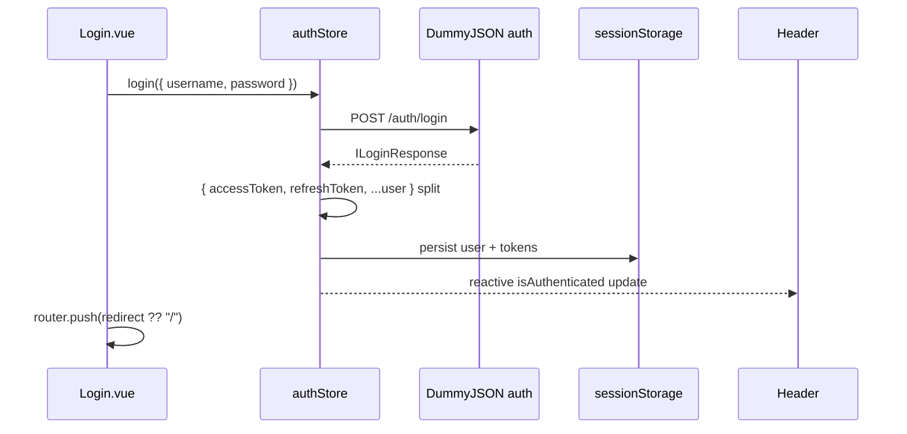

# Architecture and Data Flow

## High-level architecture


```mermaid
flowchart TB
    subgraph Entry["Entry (src/main.ts)"]
        MAIN["createApp(App)\napp.use(Pinia)\napp.use(router)\nregisterSW()"]
    end

    subgraph Shell["App.vue shell (always mounted)"]
        HDR["Header → Navbar\n(search, sidebar toggle, cart)"]
        SB["Sidebar\n(category links)"]
        RV["router-view"]
        FTR["Footer"]
        BTT["BackToTopButton"]
    end

    subgraph Router["Vue Router — 10 routes"]
        HOME["/ → Home"]
        PROD["/product/:id → ProductSingle"]
        CAT["/category/:category → CategoryProduct"]
        CART["/cart → Cart"]
        SEARCH["/search/:searchTerm → Search"]
        MISC["/support · /download · /login · /register"]
        PROF["/profile → Profile (requiresAuth)"]
    end

    subgraph Stores["Pinia stores"]
        PS["productStore"]
        CS["categoryStore"]
        SS["searchStore"]
        CARTS["cartStore ↔ localStorage"]
        SBS["sidebarStore"]
        AUTH["authStore ↔ sessionStorage"]
    end

    EXT[("DummyJSON API\nhttps://dummyjson.com")]

    Browser[Browser] --> MAIN
    MAIN --> HDR & SB & RV & FTR & BTT
    RV --> Router
    Router --> Stores
    Stores --> EXT
```

This is a client-side SPA. Vue Router changes the component shown inside `router-view` without
requesting a new HTML document for every navigation. Vue Router is Vue's official client-side
routing solution; see the [Vue Router guide](https://router.vuejs.org/guide/).

## Page layout (App shell)

Every route renders inside the same persistent shell owned by [`src/App.vue`](../src/App.vue).
Only `router-view` (and the conditional `CartMessage` toast) changes per page:


```mermaid
flowchart TB
    subgraph VIEWPORT["Browser viewport"]
        direction TB
        HEADER["Header (top links + Navbar:\nlogo, search, cart button)"]
        BODY["router-view\n(Home / ProductSingle / CategoryProduct /\nCart / Search / Support / Download / Login / Register / Profile)"]
        FOOTER["Footer (policy/about links)"]
    end
    SIDEBAR["Sidebar (off-canvas drawer)\nAll Categories → /category/:slug"] -.- BODY
    TOAST["CartMessage toast (overlay)\nshown 2 s after add-to-cart"] -.- BODY
    TOPBTN["BackToTopButton (floating)\nappears after 300 px scroll"] -.- VIEWPORT

    HEADER --> BODY --> FOOTER
```

```text
┌─────────────────────────────────────┐
│ Header → Navbar                     │
├──────┬──────────────────────────────┤
│ Side │ router-view                  │
│ bar  │                              │
│ (hid │                              │
│ den) │                              │
├──────┴──────────────────────────────┤
│ Footer                              │
└─────────────────────────────────────┘
  + CartMessage overlay (conditional)
  + BackToTopButton (floating, >300px)
```

## Startup sequence

[`src/main.ts`](../src/main.ts) is the entry point:

1. Bootstrap CSS, Bootstrap Icons, Bootstrap JavaScript, and global Sass are loaded.
2. `createApp(App)` creates the Vue application.
3. Pinia and the router are installed.
4. The PWA registration helper is invoked when service workers are supported.
5. Vue mounts to the `#app` element in `index.html`.

[`src/App.vue`](../src/App.vue) owns the persistent shell (Header, Sidebar, `router-view`,
Footer) and calls `authStore.restoreSession()` in `onMounted` to revalidate a stored
`sessionStorage` token via `GET /auth/me`. See the
[authentication guide](10-authentication.md) and
[Vue lifecycle](https://vuejs.org/guide/essentials/lifecycle.html).

## Routing

[`src/router/index.ts`](../src/router/index.ts) uses `createWebHistory`. Home is imported eagerly;
the other nine pages use dynamic imports and therefore become separate build chunks. This follows Vue
Router's [lazy-loading route pattern](https://router.vuejs.org/guide/advanced/lazy-loading).

`/profile` carries `meta: { requiresAuth: true }`, and a global `router.beforeEach()` guard
redirects unauthenticated visits to `/login?redirect=<original-path>`. `Login.vue` navigates back
to that path with `router.push()` after a successful login. Full flow — including why
`meta.requiresAuth` alone protects nothing and why client guards are UX rather than backend
security — is documented in the [authentication guide](10-authentication.md). References:
[Navigation guards](https://router.vuejs.org/guide/advanced/navigation-guards.html),
[Route meta fields](https://router.vuejs.org/guide/advanced/meta.html),
[Programmatic navigation](https://router.vuejs.org/guide/essentials/navigation.html).

## Pinia stores

Pinia separates shared state from rendering. Its concepts are documented in the
[official Pinia documentation](https://pinia.vuejs.org/core-concepts/).

| Store | State owned | External dependency |
|---|---|---|
| `productStore` | Product list, selected product, request statuses | DummyJSON |
| `categoryStore` | Categories, selected category products, statuses | DummyJSON |
| `searchStore` | Search results and request status | DummyJSON |
| `cartStore` | Cart lines, totals, item count, confirmation visibility | `localStorage` |
| `sidebarStore` | Sidebar open/closed state | None |
| `authStore` | User, access/refresh tokens, loading + error flags | DummyJSON auth + `sessionStorage` |

The API stores use four status strings from `src/utils/status.ts`:

```text
IDLE → LOADING → SUCCEEDED
                 or FAILED
```

Views use `LOADING` to show `Loader`. Stores expose error state, but the current pages generally do
not render a dedicated error message.

## Catalog data flow


```mermaid
sequenceDiagram
    participant View
    participant Store as Pinia store
    participant API as DummyJSON
    participant List as ProductList
    participant Card as Product

    View->>Store: call fetch action
    Store->>Store: status = LOADING
    Store->>API: fetch products/categories/search
    API-->>Store: JSON response
    Store->>Store: save data
    Store->>Store: set status to SUCCEEDED
    Store-->>View: reactive update
    View->>List: products prop
    List->>List: calculate discountedPrice
    List->>Card: normalized product prop
```

The API endpoints are documented in
[DummyJSON Products](https://dummyjson.com/docs/products). Note that `fetch()` only rejects on
network-level failures; HTTP errors such as 404 still resolve. Production-quality fetch actions
should check `response.ok`, as explained in
[Using the Fetch API](https://developer.mozilla.org/en-US/docs/Web/API/Fetch_API/Using_Fetch).

## Cart data flow


```mermaid
sequenceDiagram
    participant Detail as ProductSingle
    participant Cart as cartStore
    participant Storage as localStorage
    participant Navbar
    participant CartPage as Cart view

    Detail->>Cart: addToCart(product, quantity, prices)
    Cart->>Storage: persist serialized cart
    Cart-->>Navbar: reactive cart update
    Navbar->>Cart: recalculate totals
    Cart-->>CartPage: lines, count, total
```

Only the cart and the auth session are persistent. Product, category, search, and sidebar state
are recreated after a reload. The two persistent stores intentionally differ: the cart uses
`localStorage` (convenience data worth keeping across sessions) while auth uses
[`sessionStorage`](https://developer.mozilla.org/en-US/docs/Web/API/Window/sessionStorage)
(user + short-lived tokens, cleared when the tab session ends). See
[Web Storage](https://developer.mozilla.org/en-US/docs/Web/API/Web_Storage_API) and the
[authentication guide](10-authentication.md#difference-between-sessionstorage-and-localstorage).

## Auth data flow


```mermaid
sequenceDiagram
    participant Form as Login.vue
    participant Store as authStore
    participant API as DummyJSON auth
    participant Storage as sessionStorage
    participant Header

    Form->>Store: login({ username, password })
    Store->>API: POST /auth/login
    API-->>Store: ILoginResponse
    Store->>Store: { accessToken, refreshToken, ...user } split
    Store->>Storage: persist user + tokens
    Store-->>Header: reactive isAuthenticated update
    Form->>Form: router.push(redirect ?? "/")
```

`App.vue` revalidates on startup via `GET /auth/me`; `/profile` is guarded by
`meta.requiresAuth` + `beforeEach`. See the [authentication guide](10-authentication.md).

## Type and utility layers

- `src/types/IProducts.ts` describes product fields.
- `src/types/IAuth.ts` describes `ILoginCredentials` (username + password),
  `IAuthUser` (persisted profile, no password), and `ILoginResponse` (user + tokens).
  The password lives only in the credentials type and the login request body — never in
  Pinia state or `sessionStorage`. See the [authentication guide](10-authentication.md).
- `src/types/ICarts.ts` adds cart quantity and line total fields.
- `src/types/IFilters.ts` describes category data, although its current inheritance should be
  corrected; see the [roadmap](07-known-issues-and-roadmap.md).
- `src/utils/apiURL.ts` contains the DummyJSON base URL.
- `src/utils/helpers.ts` formats prices in US dollars.
- `src/utils/images.ts` centralizes imported image assets.
- `src/utils/status.ts` centralizes request status values.

---

## Next steps

- [Folder structure](03-folder-structure.md) — where files live
- [Components, pages & routes](04-components-pages-and-routes.md) — UI inventory
- [Authentication](10-authentication.md) — login flow, session, guards
- [Pinia stores deep-dive](06-development-testing-and-deployment.md#pinia-stores) — store internals
- [Known issues & roadmap](07-known-issues-and-roadmap.md) — architecture-level fixes
