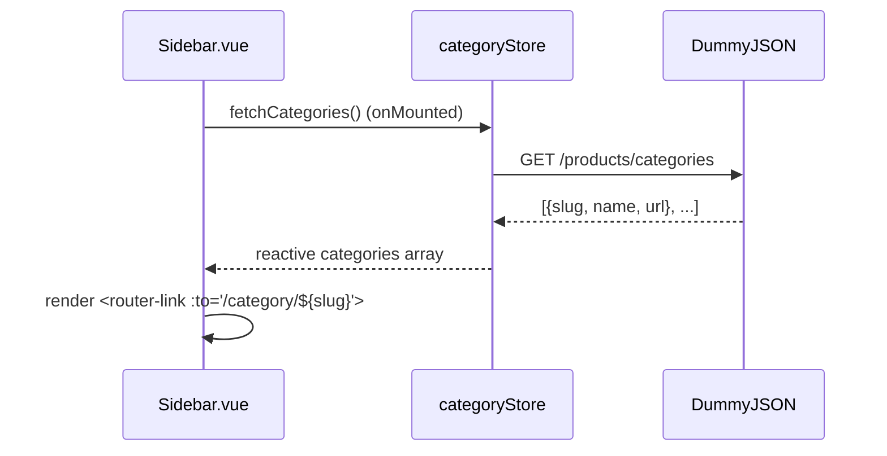
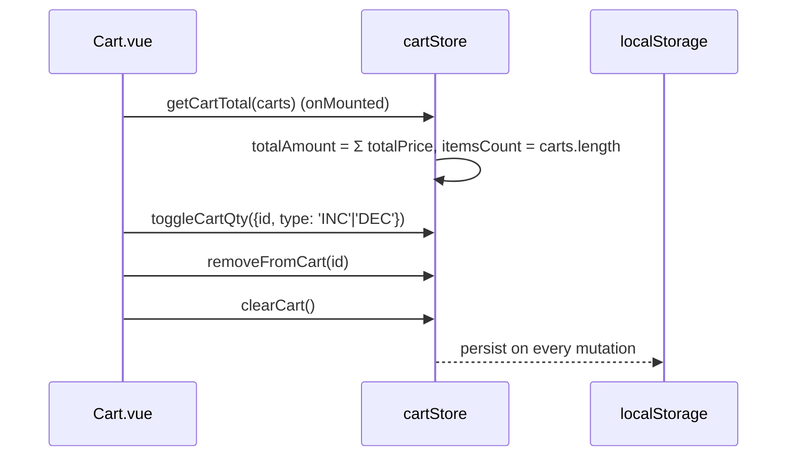

# Components, Pages, and Routes

## Route map

| Path | Name | View | Responsibility | Lazy-loaded |
|---|---|---|---|---|
| `/` | `home` | `Home.vue` | Carousel, shuffled catalog, first four categories | No (eager) |
| `/product/:id` | `product` | `ProductSingle.vue` | Product details, quantity, add to cart | Yes |
| `/category/:category` | `category` | `CategoryProduct.vue` | Category-specific catalog | Yes |
| `/cart` | `cart` | `Cart.vue` | Cart table, quantity controls, totals | Yes |
| `/search/:searchTerm` | `search` | `Search.vue` | Search results or empty state | Yes |
| `/support` | `support` | `Support.vue` | Static support page (placeholder) | Yes |
| `/download` | `download` | `Download.vue` | Static download page (placeholder) | Yes |
| `/login` | `login` | `Login.vue` | Login form (placeholder, no auth logic) | Yes |
| `/register` | `register` | `Register.vue` | Registration form (placeholder, no auth logic) | Yes |
| Path | Name | View | Responsibility | Lazy-loaded |
|---|---|---|---|---|
| `/` | `home` | `Home.vue` | Carousel, shuffled catalog, first four categories | No (eager) |
| `/product/:id` | `product` | `ProductSingle.vue` | Product details, quantity, add to cart | Yes |
| `/category/:category` | `category` | `CategoryProduct.vue` | Category-specific catalog | Yes |
| `/cart` | `cart` | `Cart.vue` | Cart table, quantity controls, totals | Yes |
| `/search/:searchTerm` | `search` | `Search.vue` | Search results or empty state | Yes |
| `/support` | `support` | `Support.vue` | Static support page (placeholder) | Yes |
| `/download` | `download` | `Download.vue` | Static download page (placeholder) | Yes |
| `/login` | `login` | `Login.vue` | Login form (placeholder, no auth logic) | Yes |
| `/register` | `register` | `Register.vue` | Registration form (placeholder, no auth logic) | Yes |

The application does not currently define a 404/not-found route.

## Persistent components

### Header

`Header.vue` contains the top links and embeds `Navbar`. Several links—seller, download, login,
registration, and support—are visual placeholders rather than completed flows.

**Structure:**
```vue
<header class="header text-white">
  <nav class="container">
    <div class="header-cnt">
      <section class="header-cnt-top">...</section>  <!-- top links -->
      <section class="header-cnt-bottom">
        <Navbar />  <!-- logo, search, cart, sidebar toggle -->
      </section>
    </div>
  </nav>
</header>
```

### Navbar

`Navbar.vue` coordinates three shared areas:

- opening the category sidebar (`sidebarStore.setSidebarOn()`);
- searching and displaying category shortcuts (fetches categories on mount);(fetches categories on mount);
- showing the cart count and preview (`CartModal`).

It watches cart state deeply and asks the cart store to recalculate totals after changes.

**Props emitted/used:**
- Emits `search` event with search term (via `Router.push('/search/' + term)`)
- Reads `cartStore.carts` via `storeToRefs` for reactive cart count
- Uses `sidebarStore.isSidebarOn` to show/hide drawer

### Sidebar

`Sidebar.vue` reads all categories from the category store and creates category routes.
The sidebar store controls whether it is translated on-screen (CSS `transform`).

**Data flow:**

`Sidebar.vue` reads all categories from the category store and creates category routes.
The sidebar store controls whether it is translated on-screen (CSS `transform`).

**Data flow:**


### Footer

`Footer.vue` contains policy/about links. They currently route to `/` and should eventually be
replaced by real pages or external documents.

## Catalog components

### ProductList

`ProductList.vue` accepts products as a prop, calculates `discountedPrice`, and renders one
`Product` component per entry.

**Props:**
```ts
props: {
  products: {
    type: Array as () => IProducts[],
    required: true
  }
}
```

**Computed — `productsWithDiscount`:**
```ts
computed(() => products.value.map(p => ({
  ...p,
  discountedPrice: p.price - p.price * (p.discountPercentage / 100)
})))
```

This calculation is duplicated in `ProductSingle.vue` — see [roadmap](07-known-issues-and-roadmap.md#duplicate-discount-calculation).

### Product

`Product.vue` is a clickable product card. It displays:

- category;
- image (first from `images[]`);
- brand (falls back to `category` if `brand` is empty);
- title;
- original price (formatted via `formatPrice`);
- discounted price (formatted via `formatPrice`);
- discount percentage badge (`20% Off`).

**Props:**
```ts
props: {
  product: { type: Object as () => IProducts, required: true }
}
```

**Template uses `RouterLink`** to `/product/${product.id}`. Tests stub this with `<a><slot /></a>`.
- original price (formatted via `formatPrice`);
- discounted price (formatted via `formatPrice`);
- discount percentage badge (`20% Off`).

**Props:**
```ts
props: {
  product: { type: Object as () => IProducts, required: true }
}
```

**Template uses `RouterLink`** to `/product/${product.id}`. Tests stub this with `<a><slot /></a>`.

### ProductSingle

`ProductSingle.vue` requests one product based on the route ID, derives its discounted price,
limits the quantity control to stock, and creates the cart payload.

**Key local state:**
```ts
const quantity = ref(1)  // user-adjustable, clamped 1..stock
```

**Computed:**
- `thumbItems` — `product.images.slice(1, 4)` for thumbnails
- `discountedPrice` — same formula as `ProductList`
- `outOfStock` — `product.stock === 0`

**Add-to-cart handler:**
```ts
const addToCartHandler = (product) => {
  const discountedPrice = product.price - product.price * (product.discountPercentage / 100)
  const totalPrice = quantity.value * discountedPrice
  cartStore.addToCart({ ...product, quantity: quantity.value, discountedPrice, totalPrice })
  cartStore.setCartMessageOn()
}
```

The thumbnails are display-only (clicking does not swap main image), and the “Buy now” button has
no handler.
**Key local state:**
```ts
const quantity = ref(1)  // user-adjustable, clamped 1..stock
```

**Computed:**
- `thumbItems` — `product.images.slice(1, 4)` for thumbnails
- `discountedPrice` — same formula as `ProductList`
- `outOfStock` — `product.stock === 0`

**Add-to-cart handler:**
```ts
const addToCartHandler = (product) => {
  const discountedPrice = product.price - product.price * (product.discountPercentage / 100)
  const totalPrice = quantity.value * discountedPrice
  cartStore.addToCart({ ...product, quantity: quantity.value, discountedPrice, totalPrice })
  cartStore.setCartMessageOn()
}
```

The thumbnails are display-only (clicking does not swap main image), and the “Buy now” button has
no handler.

## Cart components

### CartModal

`CartModal.vue` previews cart lines when hovering over the navbar cart. The “view my shopping cart”
element is currently a paragraph rather than a navigable link.

**Props:**
```ts
props: { carts: { type: Array as () => ICartItems[], default: () => [] } }
```

Shows empty state ("No products yet") or list with thumbnail, title, discounted price, and quantity.

### CartMessage

`CartMessage.vue` shows a confirmation overlay for two seconds after a product is added.

Controlled by `cartStore.isCartMessageOn` (set by `setCartMessageOn()`, auto-cleared after 2000 ms
via `setTimeout`). Rendered conditionally in `App.vue` / views: `<CartMessage v-if="cartMessageStatus" />`.

### Cart view

`Cart.vue``Cart.vue` has two states:

- empty-cart illustration with a return-to-shopping link (`<RouterLink to="/">`);(`<RouterLink to="/">`);
- table containing product lines, quantities, prices, delete controls, and totals.

**Cart line columns:** S.N., Product, Unit Price, Quantity (INC/DEC buttons), Total Price, Actions (Delete).

Footer shows:
- Clear Cart button (trash icon)
- Total (itemsCount) items: formatted totalAmount
- Check Out button (placeholder, no handler)

**Data flow:**

**Cart line columns:** S.N., Product, Unit Price, Quantity (INC/DEC buttons), Total Price, Actions (Delete).

Footer shows:
- Clear Cart button (trash icon)
- Total (itemsCount) items: formatted totalAmount
- Check Out button (placeholder, no handler)

**Data flow:**


## Supporting components

- `HeaderSlider.vue` —— Bootstrap carousel for two local images (`slider_img_1.jpg`, `slider_img_2.jpg`).
- `Loader.vue` —— local SVG spinner, shown while `status`status ====== STATUS.LOADING`STATUS.LOADING`.
- `BackToTopButton.vue` —— floating button after 300 px scroll,, smooth-scrolls to top;
  covered by `BackToTopButton.spec.ts` (visibility thresholds, `scrollTo` args, `aria-label`).

## Component communication patterns

| Pattern | Example |
|---|---|
| Props down | `ProductList` passes a product to `Product` |
| Store access | `Navbar`, `Sidebar`, and views read Pinia stores |
| Route parameters | Product, category, and search views read `useRoute()` |
| Local component state | Product quantity and navbar search term use `ref()` |
| Computed derivation | Discount price, thumbnails, categories, and store selectors |
| Watchers | Category/search route changes and cart changes |
| Event emit (via Router) | Navbar search → `router.push('/search/' + term)` |

Vue Router documents route-driven data loading in
[Data Fetching](https://router.vuejs.org/guide/advanced/data-fetching.html).

---

## Next steps

- [Architecture & data flow](02-architecture-and-data-flow.md) — how components connect to stores
- [Styling & accessibility](05-styling-and-accessibility.md) — component styling patterns
- [Known issues & roadmap](07-known-issues-and-roadmap.md) — component-level fixes
- [TS/JS concepts](09-typescript-javascript-concepts.md) — patterns like `storeToRefs`, computed, watch
