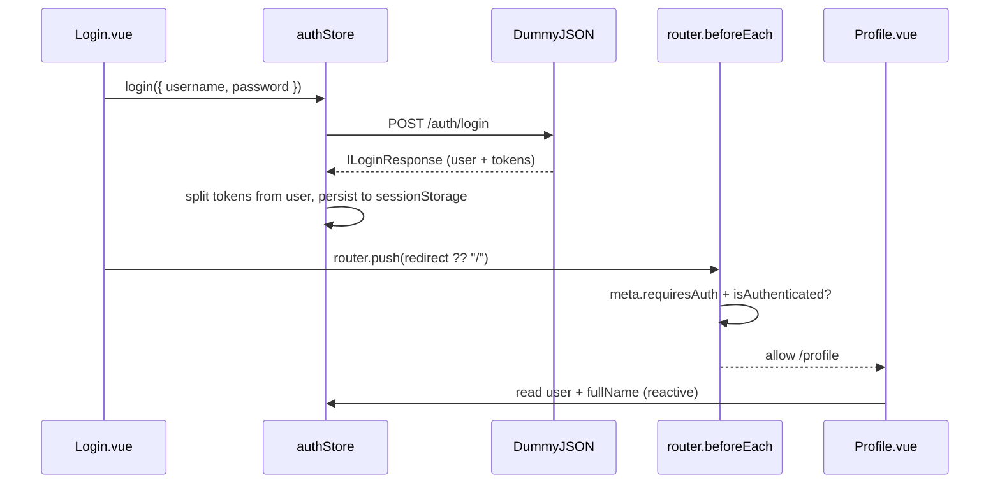

# Authentication

This page documents the authentication work implemented with Vue 3 + TypeScript + Pinia +
Vue Router against the DummyJSON auth API. It explains WHAT the code does and WHY it is shaped
that way.

Related pages:

- [Architecture & data flow](02-architecture-and-data-flow.md) — stores and routing overview
- [Components, pages & routes](04-components-pages-and-routes.md) — Login, Profile, Header inventory
- [TS/JS concepts](09-typescript-javascript-concepts.md) — language patterns used here
- [References](08-references.md) — official documentation links

## Authentication flow with DummyJSON

SnapUp uses two DummyJSON endpoints (see
[DummyJSON auth](https://dummyjson.com/docs/auth)):



1. `POST /auth/login` exchanges credentials for a user object plus `accessToken` /
   `refreshToken`.
2. `GET /auth/me` revalidates a stored access token on app startup (`App.vue` calls
   `restoreSession()` in `onMounted`).
3. `/profile` is protected with `meta: { requiresAuth: true }` and a global `beforeEach` guard.
4. Unauthenticated visits to `/profile` are redirected to `/login?redirect=/profile`; after a
   successful login the app navigates back to the original route.

WHY two endpoints: login proves identity once; `/auth/me` proves the stored token is still
valid after a reload without asking for the password again.

References:

- [DummyJSON authentication](https://dummyjson.com/docs/auth)
- [MDN Using Fetch](https://developer.mozilla.org/en-US/docs/Web/API/Fetch_API/Using_Fetch)
- [Vue lifecycle](https://vuejs.org/guide/essentials/lifecycle.html)

## `POST /auth/login`

`src/stores/authStore.ts` `login()` sends:

```ts
await fetch(`${BASE_URL}auth/login`, {
  method: "POST",
  headers: { "Content-Type": "application/json" },
  credentials: "include",
  body: JSON.stringify({ username, password, expiresInMins: 30 }),
});
```

WHY each option:

- `method: "POST"` — credentials go in the body, not the URL (URLs are logged/cached).
- `Content-Type: application/json` — tells DummyJSON how to parse the body.
- `credentials: "include"` — allows cookies to be sent if the backend uses them.
- `expiresInMins: 30` — demo token lifetime; short lifetimes limit the damage of a leaked token.

The action checks `response.ok` before parsing. WHY: `fetch()` only rejects on network
failures; HTTP 400/401/404/500 still resolve. Without the check, an error payload would be
treated as a successful login. This store is now the correct example; the older catalog stores
still lack this check (see the [roadmap](07-known-issues-and-roadmap.md)).

```ts
if (!response.ok) {
  const errorData = await response.json().catch(() => null);
  throw new Error(errorData?.message ?? "Unable to log in.");
}
```

`await response.json().catch(() => null)` guards against an empty/non-JSON error body.
`?.` (optional chaining) avoids throwing when `errorData` is `null`.

References:

- [MDN Using Fetch](https://developer.mozilla.org/en-US/docs/Web/API/Fetch_API/Using_Fetch)
- [`Response.ok`](https://developer.mozilla.org/en-US/docs/Web/API/Response/ok)

## `GET /auth/me`

`restoreSession()` runs once from `App.vue`:

```ts
onMounted(() => {
  authStore.restoreSession();
});
```

It sends the stored token back for validation:

```ts
await fetch(`${BASE_URL}auth/me`, {
  method: "GET",
  headers: { Authorization: `Bearer ${this.accessToken}` },
  credentials: "include",
});
```

WHY: `sessionStorage` survives a reload but Pinia state does not (Pinia state is in-memory).
On startup the store rehydrates `user`/`tokens` from `sessionStorage`, then asks the backend
“is this token still good?” If yes, it refreshes the cached user; if no (`!response.ok` or
network error), it calls `logout()` to clear stale credentials instead of leaving the UI in a
half-authenticated state.

Reference: [Vue lifecycle](https://vuejs.org/guide/essentials/lifecycle.html).

## Login credentials, user, and response typing

`src/types/IAuth.ts` defines three interfaces:

```ts
interface ILoginCredentials { username: string; password: string; }

interface IAuthUser {
  id: number; username: string; email: string;
  firstName: string; lastName: string; gender: string; image: string;
}

interface ILoginResponse extends IAuthUser {
  accessToken: string; refreshToken: string;
}
```

- **Login credentials typing** (`ILoginCredentials`) — the minimal shape `login()` accepts.
- **Authenticated user typing** (`IAuthUser`) — what the app keeps long-term for display
  (name, avatar, email). No password, no tokens.
- **Login response typing** (`ILoginResponse extends IAuthUser`) — the full backend payload:
  user fields plus tokens. `extends` avoids repeating the seven user fields.

Reference: [TypeScript documentation](https://www.typescriptlang.org/docs/).

## Why password belongs only in login credentials

`password` appears in `ILoginCredentials` and in the `POST /auth/login` body — and nowhere
else. It is never assigned to `state.user`, never written to `sessionStorage`, and never read
back.

WHY:

1. The backend only needs the password once to verify identity; after that the token replaces
   it.
2. Keeping the password in memory/storage widens the blast radius of an XSS bug or a stolen
   laptop session.
3. Persisted state can be read by any script on the origin; a token can expire, a password
   generally does not.

## Why password should not be stored in Pinia or sessionStorage

The store deliberately splits the response with object destructuring + rest properties:

```ts
const { accessToken, refreshToken, ...user } = data;
this.user = user; // IAuthUser — no password, no tokens
sessionStorage.setItem(USER_KEY, JSON.stringify(user));
```

- **Object destructuring** pulls the two tokens out by name.
- **Rest properties** (`...user`) collect everything else into the persisted user object.

WHY this matters: even if DummyJSON echoed a password hash back, the rest object would still
exclude anything explicitly destructured — but more importantly the type `IAuthUser` makes it a
compile error to assign a password-bearing object to `state.user`. Tokens are stored separately
under their own keys so they can be cleared/rotated independently of profile data.

References:

- [MDN sessionStorage](https://developer.mozilla.org/en-US/docs/Web/API/Window/sessionStorage)
- [MDN Web Storage](https://developer.mozilla.org/en-US/docs/Web/API/Web_Storage_API)

## Pinia authentication state

`src/stores/authStore.ts` uses the Options-style `defineStore("auth", { state, getters,
actions })`.

### state, getters and actions

```ts
state: () => ({
  user: getStoredUser() as IAuthUser | null,
  accessToken: sessionStorage.getItem(ACCESS_TOKEN_KEY),
  refreshToken: sessionStorage.getItem(REFRESH_TOKEN_KEY),
  isLoading: false,
  error: null as string | null,
}),
```

- `state` holds the reactive source of truth (user + tokens + UI flags).
- `getters` derive synchronous read-only views (`isAuthenticated`, `fullName`).
- `actions` perform async work and are the only place that mutates state (`login`,
  `restoreSession`, `logout`).

References:

- [Pinia core concepts](https://pinia.vuejs.org/core-concepts/)
- [Pinia state](https://pinia.vuejs.org/core-concepts/state.html)
- [Pinia getters](https://pinia.vuejs.org/core-concepts/getters.html)
- [Pinia actions](https://pinia.vuejs.org/core-concepts/actions.html)

### isAuthenticated

```ts
isAuthenticated: (state): boolean => Boolean(state.user && state.accessToken),
```

WHY both conditions: a cached user without a token (or a token without a user) is not a valid
session. Requiring both avoids showing a “logged in” Header when `restoreSession()` is about
to fail and clear the session.

### fullName

```ts
fullName: (state): string =>
  !state.user ? "" : `${state.user.firstName} ${state.user.lastName}`,
```

WHY a getter instead of inline template logic: the format is defined once and reused by
`Header.vue` and `Profile.vue`. Getters are cached like `computed` — they re-evaluate only when
`state.user` changes.

### login()

Signature: `async login(credentials: ILoginCredentials): Promise<boolean>`.

- `async/await` keeps the asynchronous fetch chain readable instead of nested `.then()`.
- `Promise<boolean>` lets the caller branch without catching: `Login.vue` navigates only on
  `true` and otherwise leaves the error message rendered from `authStore.error`.
- `try/catch/finally` separates three concerns: happy path (`try`), error mapping (`catch`
  sets a displayable `error` string), and UI cleanup (`finally` always resets `isLoading` so
  the submit button never sticks on “Logging in…”).
- `error instanceof Error ? error.message : "Something went wrong."` uses `typeof`-family
  narrowing: only `Error` is guaranteed to have `.message`, so the check keeps the assignment
  type-safe.

### restoreSession()

No arguments, no return value. Called once on startup. Skips work when there is no token,
revalidates with `GET /auth/me` otherwise, and calls `logout()` on any failure. WHY logout on
failure rather than keeping the cached user: a stale user with a dead token would pass no
real authorization check and would confuse the guard.

### logout()

Synchronous. Nulls `user`, `accessToken`, `refreshToken`, `error` and removes all three
`sessionStorage` keys. `Header.vue` calls it then pushes `/`:

```ts
const handleLogout = async () => {
  authStore.logout();
  await router.push("/");
};
```

WHY clear all three keys and not just the user: leftover tokens would let the next page load
re-authenticate silently via `restoreSession()`.

### sessionStorage

Keys (`snapup-user`, `snapup-access-token`, `snapup-refresh-token`) hold JSON-serialized user
and raw token strings. `getStoredUser()` wraps `JSON.parse` in `try/catch`: on corrupt data it
removes the bad key and returns `null` instead of crashing store initialization. (The cart
store still lacks this guard — see the roadmap.)

### Difference between sessionStorage and localStorage

|  | `sessionStorage` (auth) | `localStorage` (cart) |
|---|---|---|
| Lifetime | Cleared when the tab/browser session ends | Persists across sessions until cleared |
| Scope | Per tab + origin | Per origin, shared across tabs |
| Used here for | User + short-lived tokens | Cart lines |
| WHY | Limits token exposure time; closing the tab logs out | A cart is low-risk convenience data worth keeping |

WHY the split is intentional: convenience (cart) favors persistence; credentials favor a
smaller window of exposure.

References:

- [MDN sessionStorage](https://developer.mozilla.org/en-US/docs/Web/API/Window/sessionStorage)
- [MDN Web Storage](https://developer.mozilla.org/en-US/docs/Web/API/Web_Storage_API)
- [MDN `localStorage`](https://developer.mozilla.org/en-US/docs/Web/API/Window/localStorage)

## Login form mechanics

`src/views/Login/Login.vue` uses `<script setup lang="ts">` with:

```ts
const username = ref("");
const password = ref("");
```

- **Vue `ref()`** creates reactive string holders; `.value` is used in script,
  unwrapped automatically in the template. Each keystroke updates state without manual DOM
  queries. Reference:
  [Reactivity fundamentals](https://vuejs.org/guide/essentials/reactivity-fundamentals.html).
- **`v-model`** (`v-model="username"`) provides two-way binding between input and ref.
- **`@submit.prevent`** (`<form @submit.prevent="handleLogin">`) intercepts the native submit,
  preventing a full-page reload so the SPA can handle login in place. It also preserves
  Enter-key submission and keeps `required` validation working.
- **`async/await` + `Promise<boolean>`** — `handleLogin` awaits `login()` and returns early on
  `false`, so navigation only happens after credentials are verified.

After success:

```ts
const redirect = typeof route.query.redirect === "string" ? route.query.redirect : "/";
await router.push(redirect);
```

- **`router.push()`** performs programmatic navigation (no `<router-link>` click needed).
- **`route.query.redirect`** is the URL the guard saved (e.g. `/profile`). See
  [Programmatic navigation](https://router.vuejs.org/guide/essentials/navigation.html).
- **`typeof` narrowing** (`typeof … === "string"`) is required because query values can be
  `string | string[] | null | undefined`; without it TypeScript rejects passing the value to
  `router.push()`. Reference:
  [TypeScript documentation](https://www.typescriptlang.org/docs/).

## Reactive UI updates

### Header changing automatically after login

`Header.vue` reads the store directly in the template:

```vue
<template v-if="authStore.isAuthenticated">
  <!-- avatar + fullName + Log out -->
</template>
<template v-else>
  <!-- Register + Log in -->
</template>
```

No event bus, no manual refresh. WHY it works: **Pinia state is reactive** — `isAuthenticated`
is a getter over reactive state, so when `login()`/`logout()` mutates `user`, every component
reading the getter re-renders automatically. The same mechanism updates `fullName` and the
optional-chained avatar (`authStore.user?.image` — safe before login because `user` is
`null`).

Reference: [Reactivity fundamentals](https://vuejs.org/guide/essentials/reactivity-fundamentals.html).

### Profile page

`src/views/Profile/Profile.vue` is a read-only view over the same store: avatar, `fullName`,
username, email, gender. It renders `<section v-if="authStore.user">` so a direct navigation
with no session shows nothing rather than crashing on `null`. Access control itself is done by
the router guard, not by this `v-if` (defense in depth at the UI layer only).

## Route protection

### Route meta fields and meta.requiresAuth

Only `/profile` is protected:

```ts
{ path: "/profile", name: "profile", component: () => import("@/views/Profile/Profile.vue"),
  meta: { requiresAuth: true } },
```

**Route meta fields** are arbitrary data attached to a route definition and read later in
guards (`to.meta.requiresAuth`). WHY meta instead of hardcoding `/profile` in the guard: adding
a second protected route later means adding one field, not editing guard logic.

Reference: [Route meta fields](https://router.vuejs.org/guide/advanced/meta.html).

### router.beforeEach() and global navigation guards

```ts
router.beforeEach((to) => {
  const authStore = useAuthStore();
  if (to.meta.requiresAuth && !authStore.isAuthenticated) {
    return { name: "login", query: { redirect: to.fullPath } };
  }
  return true;
});
```

- **`router.beforeEach()`** registers a **global navigation guard**: it runs before every
  navigation. Reference:
  [Navigation guards](https://router.vuejs.org/guide/advanced/navigation-guards.html).
- **Redirecting unauthenticated users**: returning a location (`{ name: "login", query: … }`)
  cancels the original navigation and starts a new one to Login.
- **Redirecting back after login**: `query.redirect = to.fullPath` preserves the original
  destination (including query/hash via `fullPath`); `Login.vue` reads it back after success.

### Authentication vs authorization

- **Authentication** (“who are you?”) — handled here: DummyJSON verifies the password and
  issues a token; `isAuthenticated` reflects that.
- **Authorization** (“what may you do?”) — not implemented: every logged-in user sees the same
  Profile; there are no roles, no per-resource permissions, no backend enforcement in this
  demo.

### Client-side route protection limitations

**`meta.requiresAuth` alone does not protect a route** — it is just data. something must read
it. Here that something is the `beforeEach` guard, which is what actually enforces the rule.

Even then, **route guards are not real backend security**:

1. All view code ships to the browser; a user can inspect chunks or disable JavaScript checks.
2. The guard only controls navigation UX — it does not stop anyone from calling DummyJSON (or a
   future SnapUp API) directly with `curl`.
3. Real security lives on the server: validating the bearer token on every request and
   authorizing the action. Client guards only improve navigation and UX (no flash of protected
   content, automatic return after login).

## Lessons learned

1. **Password should not be part of the persistent authenticated user model.** `ILoginCredentials`
   carries `password`; `IAuthUser` does not. The store splits tokens off with
   `const { accessToken, refreshToken, ...user } = data` and persists only `user` + tokens.
2. **`meta.requiresAuth` alone does not protect a route.** It is inert metadata until code reads
   it.
3. **`router.beforeEach()` is what enforces the navigation rule.** The guard checks
   `to.meta.requiresAuth && !authStore.isAuthenticated` and redirects to Login with
   `?redirect=` preserved.
4. **Pinia state is reactive, so the Header updates automatically after login/logout.** No props,
   events, or reloads — `v-if="authStore.isAuthenticated"` re-evaluates when the store mutates.
5. **Client-side route guards improve navigation and UX but are not backend security.** They
   prevent accidental navigation; they cannot stop direct API calls. Token validation must happen
   server-side per request.
6. **Public DummyJSON credentials can trigger browser password warnings because they are public
   demo credentials.** `Login.vue` displays `emilys` / `emilyspass` openly, and browsers/password
   managers may flag reuse of a well-known shared password. That is expected for a demo — never
   reuse this pattern with real user passwords, and never commit real credentials to a visible
   notice.

## What to study next

- Refresh-token rotation and silent re-auth (currently tokens expire after 30 min with no
  refresh flow).
- HttpOnly-cookie sessions vs `sessionStorage` tokens and their XSS tradeoffs.
- Route-level `beforeEnter` vs global `beforeEach`, and testing guards with a mocked Pinia store.
- Form validation UX (inline field errors, disabling submit while invalid, not only while
  loading).
- Writing `authStore.spec.ts` with stubbed `fetch` + fake `sessionStorage` (same
  `vi.stubGlobal("fetch", …)` pattern as `productStore.spec.ts`).

---

## Next steps

- [Components, pages & routes](04-components-pages-and-routes.md) — Login/Profile/Header details
- [TS/JS concepts](09-typescript-javascript-concepts.md) — destructuring, narrowing, storage
- [Known issues & roadmap](07-known-issues-and-roadmap.md) — what auth still lacks
- [References](08-references.md) — official docs for every concept above
