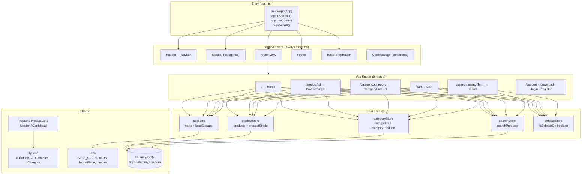
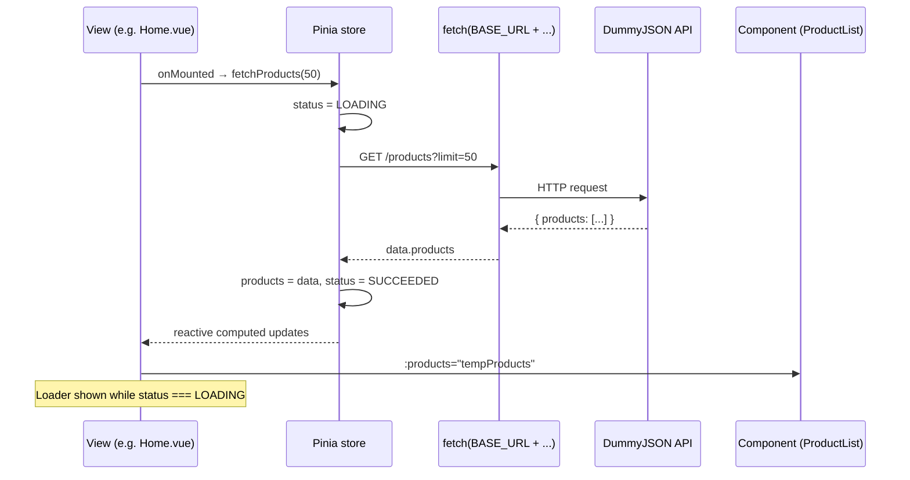
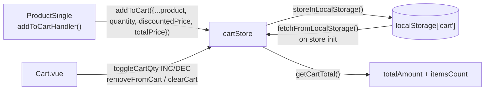

# Snapup Ecommerce — Project Wiki

> Conceptual documentation for the **web** app (`web/`). The mobile app (`mobile/`) is an untouched Flutter starter template and is out of scope here.

## 1. Overview

Snapup is a fictitious e-commerce PWA built with **Vue 3 + TypeScript + Pinia + Vite**.

- UI: Bootstrap 5 + Sass + Bootstrap Icons
- State: 5 Pinia stores
- Routing: Vue Router 5, 9 routes (most lazy-loaded)
- Data: DummyJSON public API (`https://dummyjson.com/`)
- Cart persistence: `localStorage`
- Tests: Vitest + Vue Test Utils (5 spec files)
- PWA: `vite-plugin-pwa` with Workbox runtime caching

## 2. Folder Structure (web)

```
web/
├── src/
│   ├── main.ts                 # entry: CSS, Pinia, Router, SW, mount
│   ├── App.vue                 # shell: Header + Sidebar + RouterView + Footer + BackToTop
│   ├── router/index.ts         # 9 routes
│   ├── stores/                 # Pinia: product, category, search, cart, sidebar
│   │   ├── *.ts
│   │   └── *.spec.ts           # cartStore.spec, productStore.spec
│   ├── types/                  # IProducts, ICarts, IFilters
│   ├── utils/                  # apiURL, status, helpers (formatPrice), images
│   ├── views/                  # 9 pages, each View.vue + View.scss
│   ├── components/             # 11 components, each Comp.vue + Comp.scss (+3 specs)
│   └── assets/styles/          # main.scss, variables.scss
├── public/                     # icons, manifest assets, robots.txt
├── vite.config.ts              # Vue, DevTools, PWA/Workbox, @ alias, Sass modern-compiler
├── tsconfig.app.json
└── package.json                # bun run dev / build / test:unit / lint / format
```

Conventions:

- One folder per component/view: `Name/Name.vue` + `Name/Name.scss`, imported via `<style scoped lang="scss">@use "./Name.scss";</style>`.
- `@` alias → `./src` (see `vite.config.ts:80-84`).
- Co-located specs: `Foo.spec.ts` next to `Foo.ts` / `Foo.vue`.

## 3. Web Architecture Diagram



### 3.1 Data flow (fetch → store → view)



### 3.2 Cart flow (store ↔ localStorage)



## 4. Routing

Defined in `web/src/router/index.ts`. `Home` is eagerly imported; the other 8 views are lazy-loaded via dynamic `import()` (code-splitting).

| Path | Name | View |
|---|---|---|
| `/` | home | Home |
| `/product/:id` | product | ProductSingle |
| `/category/:category` | category | CategoryProduct |
| `/cart` | cart | Cart |
| `/search/:searchTerm` | search | Search |
| `/support`, `/download`, `/login`, `/register` | — | static / placeholder pages |

## 5. State Management (Pinia)

All stores use the **Options-style** `defineStore(id, { state, getters, actions })`.

| Store | State | Key actions |
|---|---|---|
| `productStore` | `products`, `productsStatus`, `productSingle`, `productSingleStatus` | `fetchProducts(limit)`, `fetchProductSingle(id)` |
| `categoryStore` | `categories`, `categoriesStatus`, `categoryProducts`, `categoryProductsStatus` | `fetchCategories()`, `fetchProductsOfCategory(slug)` |
| `searchStore` | `searchProducts`, `searchProductsStatus` | `fetchSearchProducts(term)`, `clearSearchResults()` |
| `cartStore` | `carts`, `itemsCount`, `totalAmount`, `isCartMessageOn` | `addToCart`, `removeFromCart`, `clearCart`, `toggleCartQty`, `getCartTotal`, `setCartMessageOn/Off` |
| `sidebarStore` | `isSidebarOn` | `setSidebarOn/Off` |

Async pattern (identical in product/category/search stores):

1. Set `…Status = STATUS.LOADING`
2. `fetch()` + `response.json()`
3. On success: assign data, `STATUS.SUCCEEDED`
4. On catch: `console.error`, `STATUS.FAILED`

Views branch on this: `<Loader v-if="status === STATUS.LOADING" />` / `<ProductList v-else />`. Each store also exposes `isLoading` / `hasError` getters, though views mostly compare `STATUS` directly.

`cartStore` specifics (`web/src/stores/cartStore.ts`):

- Initialised from `localStorage` via `fetchFromLocalStorage()`; every mutation calls `storeInLocalStorage()`.
- `addToCart`: merges by `id` (qty += payload.qty, `totalPrice` recomputed) or pushes.
- `toggleCartQty({id, type})`: clamps with `Math.min(qty+1, stock)` / `Math.max(qty-1, 1)` and recomputes `totalPrice = qty * discountedPrice`.
- `getCartTotal()`: `totalAmount = Σ totalPrice`, `itemsCount = carts.length` (line count, not unit count).
- `setCartMessageOn()` shows the toast and auto-hides after 2 s via `setTimeout`.

## 6. Types

`web/src/types/` — three small interfaces:

```ts
// IProducts.ts — core model, mirrors DummyJSON product
interface IProducts { id, title, description, price, discountPercentage,
  discountedPrice, rating, stock, brand, category, thumbnail, images: string[] }

// ICarts.ts — product + cart fields
interface ICartItems extends IProducts { quantity: number; totalPrice: number }
interface ICartState { carts: ICartItems[]; itemsCount: number; totalAmount: number; isCartMessageOn: boolean }

// IFilters.ts — product + DummyJSON category shape
interface ICategory extends IProducts { slug: string; name: string; url: string }
```

Note: `discountedPrice` is **not** returned by the API — it is computed client-side (`price - price * discountPercentage / 100`) in `ProductList.vue:18-24` and `ProductSingle.vue:31-33,52`. This duplication is a known cleanup candidate (extract to `utils/helpers.ts` next to `formatPrice`).

## 7. Components & Views

Shell (`App.vue`): `Header → Sidebar → router-view → Footer → BackToTopButton`. `CartMessage` is rendered conditionally by views that add to cart.

| Component | Role |
|---|---|
| Header / Navbar | top links + search entry + cart button |
| Sidebar | category list from `categoryStore`, toggled by `sidebarStore` |
| Product / ProductList | card + grid; `ProductList` derives `productsWithDiscount` via `computed` |
| CartModal / CartMessage | mini-cart + "added to cart" toast |
| Loader | spinner while `STATUS.LOADING` |
| HeaderSlider | home hero slider |
| Footer / BackToTopButton | static footer + scroll-to-top |

Views: `Home` (slider + randomised list + 4 category sections), `ProductSingle` (gallery, price block, qty selector, add-to-cart), `CategoryProduct`, `Search`, `Cart` (table + qty steppers + totals), `Support`, `Download`, `Login`, `Register` (last four are static/placeholder — no auth logic exists yet).

## 8. Testing — In Depth

Runner: **Vitest** (`bun run test:unit`), DOM via `jsdom`, components via `@vue/test-utils`. 5 spec files:

```
stores/cartStore.spec.ts      (12 tests, ~176 lines)
stores/productStore.spec.ts   (5 tests, ~101 lines)
components/Product/Product.spec.ts
components/CartModal/CartModal.spec.ts
components/BackToTopButton/BackToTopButton.spec.ts
```

### 8.1 Store tests — cart (`cartStore.spec.ts`)

Pattern per test: fresh Pinia (`localStorage.clear(); setActivePinia(createPinia())`) → act → assert.

- **Factory function** (`createCartItem(overrides)`): builds a valid `ICartItems` with `Partial<ICartItems>` overrides. Avoids repeating a 14-field literal in every test and makes each test declare only what it varies (`{ stock: 2, quantity: 2 }`).
- **Initial state**: `carts` is `[]` when `localStorage` is empty.
- **Add / merge**: adding the same `id` twice keeps length 1 and sums quantity.
- **Persistence**: after `addToCart`, `JSON.parse(localStorage.getItem("cart"))` contains the item — tests the `storeInLocalStorage` side effect, not just in-memory state.
- **Boundary clamping**: INC at `quantity === stock` stays; DEC at `quantity === 1` stays. These guard the `Math.min / Math.max` logic in `toggleCartQty`.
- **Totals**: two items with `totalPrice` 80 + 40 → `getCartTotal()` gives `totalAmount === 120`, `itemsCount === 2`.
- **Fake timers**: `vi.useFakeTimers()` + `setCartMessageOn()` → `isCartMessageOn === true` → `vi.advanceTimersByTime(2000)` → `false`. Tests the auto-dismiss `setTimeout` without waiting 2 real seconds; `vi.useRealTimers()` restores afterwards.

### 8.2 Store tests — product (`productStore.spec.ts`)

Pattern: `setActivePinia(createPinia()); vi.restoreAllMocks()` → stub `fetch` → `await store.fetchX()` → assert state + status.

- **Success path**: `vi.stubGlobal("fetch", vi.fn().mockResolvedValue({ json: … }))`, then assert `fetch` was called with the right URL (`expect.stringContaining("products?limit=10")` / `"products/1"`) and that `products` / `productSingle` + `…Status === STATUS.SUCCEEDED`.
- **Failure path**: `vi.fn().mockRejectedValue(new Error("Network error"))` → assert `…Status === STATUS.FAILED`. `console.error` is silenced with `vi.spyOn(console, "error").mockImplementation(() => {})` and restored, so expected errors don't pollute output.
- Key JS concept: **stubbing globals**. `fetch` is a browser/Node global; `vi.stubGlobal` replaces it for the test only. No HTTP is ever performed.

### 8.3 Component tests

`Product.spec.ts`, `CartModal.spec.ts`, `BackToTopButton.spec.ts` use `@vue/test-utils` `mount()`:

- Pass required `props` (e.g. a product object) and assert rendered text / emitted events.
- For Pinia-dependent components, wrap with a testing Pinia (`createTestingPinia` or `setActivePinia(createPinia())`) so `useXStore()` resolves.
- Run only what's needed: `bunx vitest run src/components/Product/Product.spec.ts`.

### 8.4 What is *not* tested (gaps)

- `categoryStore`, `searchStore`, `sidebarStore` have no specs (same fetch-mock pattern as `productStore` would apply).
- No router/navigation tests, no `localStorage` corruption handling (e.g. `JSON.parse` throwing on bad data), no e2e.

## 9. JavaScript / TypeScript Concepts Used

| Concept | Where | Notes |
|---|---|---|
| `Object.freeze` enum-like constant | `utils/status.ts` | `STATUS` (`IDLE/LOADING/SUCCEEDED/FAILED`) is frozen so no code can reassign it; compared by value in views and stores |
| Interface extension | `ICartItems extends IProducts`, `ICategory extends IProducts` | cart/category reuse the product shape and add fields — single source of truth |
| `import type` | stores, components | type-only imports are erased at compile time; no runtime cost |
| `Array as () => T[]` prop typing | `ProductList.vue:13` | Vue runtime prop validation needs a constructor; the cast gives TS the element type |
| `<script setup>` + Composition API | most views/components | `ref`, `computed`, `watch`, `onMounted` from `vue`; auto-exposed to template |
| Options-style Pinia | all stores | `state/getters/actions` with `this`; `this` is typed to the store |
| `storeToRefs` | `Cart.vue:12` | destructures store state into refs **without losing reactivity** (plain destructuring would) |
| `computed` derived data | `ProductList` discount mapping, `Home` category sections, `ProductSingle` thumbs/price | cached, re-evaluates only when deps change |
| `watch` | `Home.vue:26` | shuffles products when the store list arrives |
| `onMounted` fetching | Home, Sidebar, ProductSingle, Cart | fetch-on-mount; no SSR concerns (pure SPA) |
| `async/await` + `try/catch` | all fetch actions | loading → success/failed transitions; errors logged, never thrown to UI |
| `localStorage` + `JSON` | `cartStore.ts:5-17` | string-only storage; `JSON.parse` on load, `JSON.stringify` on save |
| Clamping with `Math.min/max` | qty logic in `cartStore` + `ProductSingle` | `INC` capped by `stock`, floor of 1 |
| Optional chaining / nullish | `product?.images?.[0]`, `?? Infinity` | guards the `{} as IProducts` initial state before fetch resolves |
| `setTimeout` auto-dismiss | `setCartMessageOn` | toast hides after 2000 ms; tested with fake timers |
| Dynamic `import()` routes | `router/index.ts` | lazy-loads 8/9 views → smaller initial bundle |
| `ref` vs `reactive` | `quantity = ref(1)` in ProductSingle | `ref` for a primitive; unwrapped automatically in template |
| `Partial<T>` + spread overrides | `createCartItem` factory in spec | `{...defaults, ...overrides}` — test-only JS pattern worth reusing |

## 10. PWA / Build

`vite.config.ts`: `Vue + VueDevTools + VitePWA(autoUpdate)`, `@` alias, Sass `modern-compiler`. Manifest (`Snapup`, standalone, 192/512 px icons) + Workbox `runtimeCaching`: `CacheFirst` for DummyJSON product images, max 500 entries, 2-year expiry. `main.ts:17-20` calls `registerSW()` when `serviceWorker` is available.

Scripts: `dev` (vite), `build` (`vue-tsc` type-check + `vite build`), `preview`, `test:unit` (vitest), `lint` (eslint --fix), `format` (prettier `src/`).

## 11. Known Issues & Improvement Candidates

1. **Discount computed twice** (`ProductList.vue:19-22`, `ProductSingle.vue:31-33,52`) — extract `discountedPrice(p)` into `utils/helpers.ts` beside `formatPrice`.
2. **`itemsCount` counts lines, not units** (`cartStore.ts:68`) — `carts.length` vs `Σ quantity`; decide which the UI means.
3. **`getCartTotal(carts)` ignores its argument** (`cartStore.ts:66-69`) — reads `this.carts` regardless; either use the param or drop it.
4. **No `response.ok` check** — non-2xx JSON still resolves as success; check `response.ok` before parsing.
5. **`JSON.parse(localStorage)` can throw** on corrupted data — wrap `fetchFromLocalStorage` in `try/catch` with `[]` fallback.
6. **Auth pages are placeholders** — Login/Register have no store, validation, or API.
7. **Checkout button has no handler** (`Cart.vue:123`).
8. **Missing specs** for `categoryStore`, `searchStore`, `sidebarStore`; no router or e2e tests.
9. **`outOfStock` returns `""` instead of `false`** (`ProductSingle.vue:34-36`) — works via falsiness but type is sloppy.

## 12. References

- Vue 3 `<script setup>`: https://vuejs.org/api/sfc-script-setup.html
- Pinia stores: https://pinia.vuejs.org/core-concepts/
- Vue Router lazy loading: https://router.vuejs.org/guide/advanced/lazy-loading.html
- Vitest mocking (`stubGlobal`, fake timers): https://vitest.dev/api/
- Vue Test Utils: https://test-utils.vuejs.org/
- `storeToRefs`: https://pinia.vuejs.org/api/modules/pinia.html#storetorefs
- VitePWA / Workbox: https://vite-pwa-org.netlify.app/
- DummyJSON docs: https://dummyjson.com/docs/products
